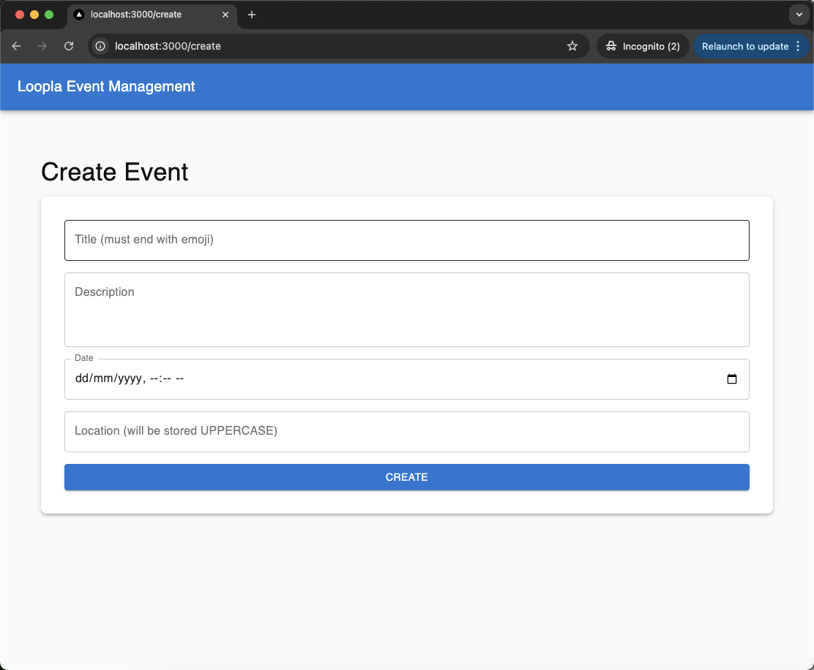

# Loopla Event Management (Test Assessment)

This is a small test assessment project built for event management.  
The app lets you:

- Create an event ✍️
- View all events 📋
- Filter events by title 🔎
- Fetch a single event by its ID 🆔


---

## 🚀 Getting Started

First, install the dependencies:

```bash
npm install
```
Then run the development server:
```bash
npm run dev
```

Now open http://localhost:3000 in your browser to see it running.


## Tech Stack

Next.js – React framework

React – UI library

Material UI (MUI) – for styling and components

TypeScript – for type safety


## API Routes

The project also provides a few simple API routes:

GET /api/events → Fetch all events

POST /api/events → Create a new event

GET /api/events/[id] → Fetch a single event by ID

## Screenshots

### Homepage


### Create Event Page


### View Event Page

